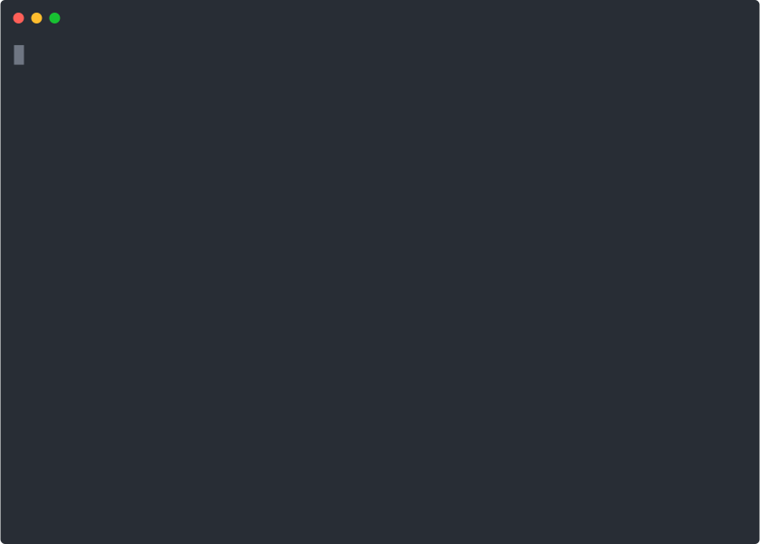

# ChainKit

[](https://circleci.com/gh/blocklayerhq/chainkit)
[](https://godoc.org/github.com/blocklayerhq/chainkit)

ChainKit is a toolkit for blockchain development. It includes primitives for creating, building and running decentralized applications built on top of [Tendermint](https://tendermint.com/) and the [Cosmos SDK](https://github.com/cosmos/cosmos-sdk).

Key features:
- **Scaffold**: Generate all the [Tendermint](https://tendermint.com/) & [Cosmos SDK](https://github.com/cosmos/cosmos-sdk) boilerplate automatically to get started in seconds.
- **Build and Run**: Under the hood, *chainkit* packages your app in a *Docker* container.
- **Testnet**: Anyone in the world can join your network by running one command. Under the hood, *chainkit* uses [IPFS](https://ipfs.io/) and [libp2p](https://libp2p.io/) to share data and discover peers.

<p align='center'>
    
</p>

## Installing

Requirements:
- Go 1.11 or higher and a [working golang](https://golang.org/doc/code.html) environment
- [Docker](https://docs.docker.com/install/)

From this repository, run:
```bash
$ make
$ cp chainkit /usr/local/bin
```

## Usage

### Create, Build & Start

In order to create a new (empty) application, just run the following:
```bash
$ cd ~/go/src/github.com
$ chainkit create demoapp
```

You can then start by running:
```bash
$ cd demoapp
$ chainkit start
```

Then open [http://localhost:42001/](http://localhost:42001/) to see *Tendermint*'s RPC interface
or open the [Explorer url](http://localhost:42000/?rpc_port=42001).

You can also access the CLI:
If chainkit is running in the current terminal, go to a new one and go to chainkit's
project directory.
```bash
$ cd demoapp
$ chainkit cli --help
$ chainkit cli status
```

All CLI commands usually accessible from a Cosmos-SDK application is available in the same way via `chainkit cli ...`.

### Edit the genesis file before the chain starts

It may be useful to edit the genesis file before the chain starts: either to add new accounts with funds or to add more validators. In order to do so, use the following command:

```bash
$ cd demoapp
$ chainkit start --edit-genesis
```

It'll spawn an editor (taken from the $EDITOR env variable if it exists) with the original genesis file. Once you apply your changes, you can review the diff before applying the new genesis file, or revert the changes.

Please note that if the chain has been started already (or any block has been created), this command won't work. The genesis is "sealed" once a new block has been created.

### Testnet

Anyone in the world can join your network. They'll need to run:

```bash
$ chainkit create demoapp
$ chainkit join <network ID>
```

where `<network ID>` is found in the output from starting the first node, or, for a mainnet, published by the network operator.

Under the hood, *chainkit* uses [IPFS](https://ipfs.io/) to transfer your network's manifest, genesis file and Docker image between nodes.

A built-in discovery mechanism (using [libp2p](https://libp2p.io/) DHT) allows nodes to discover themselves in a completely decentralized fashion.

### Moving an existing project to chainkit

When chainkit creates a new project, it generates two files:
- chainkit.yml
- Dockerfile

It's useful to understand what they contain in order to move an existing project to chainkit. If the project already contains a `Dockerfile`, you won't need to change it.

Chainkit.yml:
```yaml
name: myapp
image: chainkit-myapp
binaries:
  cli: myappcli
  daemon: myappd
```

The `name` is simply the name of the project (taken from `chainkit create myapp`).

The `image` is the docker image built by chainkit. You can specify your own image if you already have a build system building a docker image.

The last field `binaries` contain the binaries of the CLI and the Daemon of a cosmos app. It must map to what's inside the docker image, both binary names have to exist after you run a `docker build` using the Dockerfile of the project.
